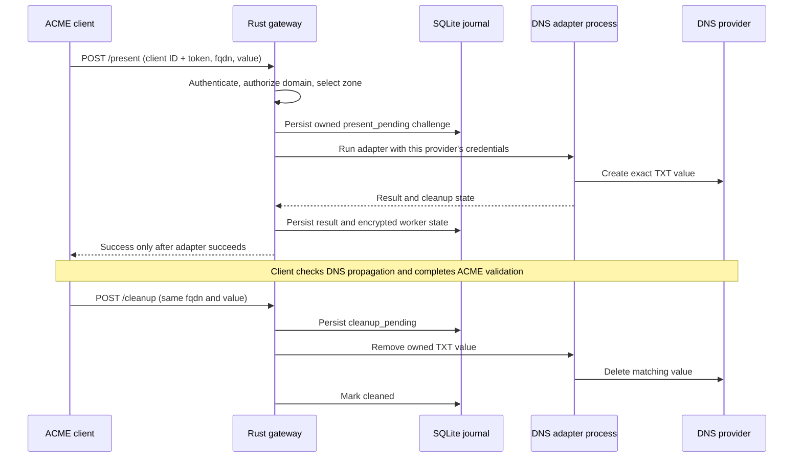

# ACME Proxy implementation plan

## Product boundary

A self-hosted DNS-01 challenge gateway. Services keep their ACME accounts, certificate
private keys, renewal schedules, and certificates. The gateway holds DNS credentials
and creates/removes only `_acme-challenge` TXT values for authorized client domains.
It is not an ACME CA or an ACME protocol reverse proxy.

**Configuration is the source of truth.** A single directory contains `config.toml`,
keys, and durable runtime state. An administrator can configure the service entirely
through TOML, or use the embedded UI, which edits the same file. No external database,
message broker, Node runtime, or cloud service is required. DNS APIs and the clients'
chosen certificate authorities remain external dependencies.

## Stack and tradeoffs

| Component | Choice | Reason |
| --- | --- | --- |
| Server | Rust, Tokio, Axum | Memory safety, typed state transitions, bounded asynchronous operations |
| Configuration | TOML with atomic file replacement | Easy to mount, inspect, back up, and manage with configuration tools |
| Runtime state | SQLite, WAL, full synchronization | Durable challenge journal without a separate database service |
| DNS integration | Pinned acme.sh `dnsapi` worker processes | Broad provider reach without reimplementing DNS APIs |
| Secret encryption | XChaCha20-Poly1305, random nonce, provider/job ID as associated data | Authenticated encryption of credentials and worker state |
| Client credentials | Random 256-bit tokens, persisted SHA-256 hashes | Revocable service identities; suitable hashing for high-entropy tokens |
| Admin UI | Embedded HTML/CSS/JavaScript | A single server binary plus the adapter bundle; no frontend build needed |

Rust alone does not make an application stable. Recovery semantics, ownership checks,
DNS adapter behavior, monitoring, and tested upgrades matter more than language choice.

`dnsapi` is the collection of shell adapters in acme.sh, not a Rust library. The current
catalog includes 184 adapters with extractable documented credential fields from
acme.sh 3.1.4. This count is **available integration surface, not verified support**.
Providers needing other binaries, files, unusual state, or undocumented variables may
need explicit packaging work. acmeproxy itself is excluded to avoid recursive routing.

An all-Go implementation using lego is a credible alternative with less integration
overhead. A Rust server plus a Go lego worker is also possible, but adds a second
compiled toolchain. Keep the worker boundary so we can add native adapters or replace
the shell backend after conformance results identify specific gaps.

## Request path

## Configuration contract

- `config.toml` defines server settings, provider instances, and client policies.
- Provider credentials are encrypted in the file. A plaintext `[providers.credentials]`
  block is accepted for initial provisioning and replaced with ciphertext at startup.
- Client plaintext `token` can be imported similarly; it becomes `token_hash`.
- IDs are stable UUIDs. Omit an ID on initial file provisioning and the server creates it.
- The UI never returns stored provider secrets or token hashes; new client tokens are
  returned once. For Basic auth the username is the client ID, password is its token.
- UI saves replace the configuration atomically and then commit its database projection.
  A commit failure after the file save makes the process refuse further work; restart
  reconstructs the projection from the authoritative file.
- File edits require restart. An external configuration change blocks UI saves until
  restart so the UI cannot silently overwrite new file-defined policy.
- Each challenge pins an encrypted credential snapshot so credential rotation does not
  change in-flight cleanup. Manual retry explicitly adopts the current credentials.
  Provider removal and zone/driver changes are blocked while challenges are unresolved.
  Client removal/revocation queues cleanup and retains ownership history.
- UI saves normalize TOML and do not preserve comments or formatting. A future
  `read_only_config` mode should make GitOps ownership explicit and disable UI mutations.

## Security and correctness contract

- Only canonical ASCII DNS names and base64url-encoded SHA-256 DNS-01 values are accepted.
  Use punycode for IDNs. Requests cannot choose record types, commands, or provider IDs.
- Exact domain scopes match exactly. `*.example.com` authorizes descendants of any depth,
  but not the apex. All suffix checks enforce DNS label boundaries.
- DNS-01 for `example.com` and `*.example.com` uses the same TXT name. This protocol
  cannot distinguish those certificate intents. Domain authorization grants the ability
  to validate wildcard certificates at that name as well.
- The longest matching configured zone routes a **new** challenge. Existing challenges
  retain their original provider, even if a more specific zone is added later.
- A challenge is owned by one client and one exact `(fqdn, value)` pair. Unknown cleanup
  is a no-op. Another client cannot clean up the pair. Different values at one name are
  tracked separately; actual coexistence depends on the adapter/provider contract.
- The worker gets a cleared environment with only catalog-listed provider options.
  Its command is fixed; arguments never become generated shell code. Output is discarded
  to prevent adapter diagnostics from leaking credentials.
- Workers have bounded execution times and their process groups are terminated on
  timeout. This is **process separation, not an OS security sandbox**. Reviewed adapters
  execute as the service user. Before general availability, separate worker OS identity,
  mount/network restrictions, resource quotas, and credential delivery over a pipe are
  required. Same-UID processes may inspect worker environment variables.
- Worker `account.conf` and `domain.conf` state is encrypted between operations. The
  scratch directory briefly holds plaintext: mount it on tmpfs in deployed environments.
  It is cleared on normal completion and stale job directories are removed at startup.
- The admin UI uses a bearer token held only in page memory, never browser storage.
  All APIs require credentials; no ambient cookie authentication or permissive CORS.
  The default listener is loopback. Use HTTPS at a reverse proxy for remote clients.

## Delivery milestones

### 1. Runnable foundation — implemented

- TOML-driven setup and a self-contained configuration directory.
- Embedded UI: provider configuration and credential replacement, client creation and
  revocation, challenge state, manual retry/cleanup, and recent audit events.
- `/present` and `/cleanup` protocol, matching acme.sh's `dns_acmeproxy` payload/response.
- Encrypted credentials and adapter state, hashed tokens, domain scopes, record ownership.
- Durable pending operations, bounded retries with backoff, expiration cleanup, single
  process lock, quota on outstanding challenges, graceful server shutdown.
- Mock-provider lifecycle, authorization, timeout, encryption, and restart tests.

### 2. DNS correctness and compatibility gate — next

- Real create/read/delete tests on dedicated zones: start with Cloudflare, Route 53,
  DigitalOcean, and RFC2136. No provider is certified by the current mocked tests.
- Provider capabilities: multi-value TXT preservation, idempotent add/remove, minimum
  TTL, state requirements, timeout ambiguity, retry classification, and rate limits.
- Test acme.sh end to end against Let's Encrypt staging or Pebble. Test lego HTTPREQ
  default mode, Nginx Proxy Manager's DnsMulti integration, Traefik, and Caddy separately
  before claiming client compatibility. HTTPREQ_MODE=RAW sends a different payload and
  is not supported by this gateway.
- Add authoritative DNS propagation diagnostics and explicit, authorized CNAME delegation.
  The first version does not follow CNAMEs or verify delegation targets.
- Recover crashes between remote mutation and local result commit. Operations are
  currently **at least once**: an ambiguous retry can duplicate DNS values for adapters
  that do not implement idempotence. Exact-once remote mutation is not available merely
  by using SQLite; use provider reads and reconciliation.
- Preserve additional adapter artifacts when necessary. Today only account/domain
  configuration is persisted. Drivers needing certificates or other files need an
  explicit adapter-specific contract.

### 3. Operational hardening and beta

- Isolated worker user/container, restricted mounts, process/memory/file limits.
- Per-client and authentication rate limiting; fair scheduling and per-zone queues.
- OIDC/passkeys or password-based admin sessions with CSRF protection and roles.
  Bootstrap token auth is sufficient for the local development preview.
- Metrics for queue age, cleanup failures, retries, provider latency; alerting and
  structured error categories with carefully redacted diagnostics.
- Master-key rotation, richer credential-version management,
  encrypted backup export and tested restore/upgrade/downgrade procedures.
- Runtime-state/audit retention and pagination; current history grows without pruning.
- Configuration validation CLI, read-only GitOps mode, hot reload with transactional
  policy checks, and comment-preserving edits if desired.
- Signed reproducible releases, SBOM, dependency/adaptor update tests, non-root images,
  ARM64 builds, CI across supported Linux distributions, external security review.

### 4. Scale only when needed

Stay single-node for the first release. SQLite plus a single worker deliberately
serializes mutations and has limited throughput. For HA, introduce PostgreSQL job
claims, fencing, distributed per-zone locks, and shared secret-management semantics;
do not run multiple replicas against a SQLite volume or claim NFS is supported.

## Research sources

- [acmeproxy.pl](https://github.com/MadCamel/acmeproxy.pl)
- [acme.sh dns_acmeproxy wire protocol](https://github.com/acmesh-official/acme.sh/blob/3661fd86b6304115e42f43910e6dd452ab9866d6/dnsapi/dns_acmeproxy.sh)
- [Pinned acme.sh DNS adapters](https://github.com/acmesh-official/acme.sh/tree/3661fd86b6304115e42f43910e6dd452ab9866d6/dnsapi)
- [lego](https://go-acme.github.io/lego/)
- [libdns interfaces](https://github.com/libdns/libdns)
- [Axum](https://docs.rs/axum/latest/axum/)
- [SQLx](https://docs.rs/sqlx/latest/sqlx/)
- [RustCrypto XChaCha20-Poly1305](https://docs.rs/chacha20poly1305/latest/chacha20poly1305/)
